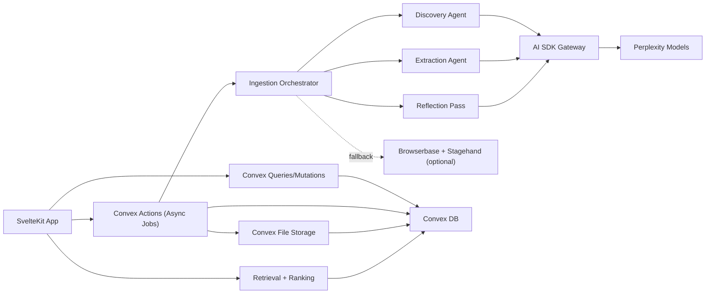

# Cable Gate Architecture Spec

Date: 2026-02-16  
Status: Draft v1 (implementation-ready)  
Stack: SvelteKit + TypeScript + Convex + Vercel AI SDK v6 (AI Gateway)

## Locked Decisions

- Known-good cable color is `White`.
- Compatibility is evaluated at `variant + use-case` granularity.
- Initial ingestion corpus is all Anker US cable listings visible on ingestion day (target ~50 items).
- Every source page is stored as a timestamped snapshot (markdown, plus metadata/provenance).

## Goals

- Answer practical queries: "connect X to Y for Z purpose".
- Normalize vendor specs into a stable schema.
- Keep claim-level evidence and citations.
- Support personal and community compatibility voting.
- Support organization-defined tag/color schemes.

## Non-Goals (v1)

- Broad multi-brand crawling.
- Real-time pricing.
- Purchase/checkout automation.
- Default Stagehand-driven browsing (fallback only).

## High-Level Architecture

## Release Scope

### P0

- Normalized variant catalog (connectors, power, data/video, model, UPC/year when available).
- Evidence-backed ingestion (URL, fetch time, snapshot, claim-level citation links).
- Variant/use-case compatibility votes.
- Query flow: "connect X to Y for Z" -> ranked variants + explanation + citations.
- Reflection loop for completeness/contradiction handling.

### P1

- Organization-specific color/tag schemes.
- Contradiction review queue.
- Confidence scoring surfaced in UI.

### P2

- Additional brands.
- Stagehand fallback for hard-to-extract pages.
- Optional accessory workflows.

## Convex Data Model

| Table | Purpose | Key fields | Primary indexes |
|---|---|---|---|
| `brands` | Manufacturer identity | `name`, `slug`, `officialDomains[]`, `country?`, `active` | `by_slug` |
| `cableModels` | Model-level identity | `brandId`, `modelNumber`, `name`, `canonicalUrl`, `category`, `releaseYear?`, `upcList[]`, `active` | `by_brand_model`, `by_brand` |
| `cableVariants` | Sellable SKU/variant | `modelId`, `sku?`, `region`, `storeUrl`, `colorName?`, `colorHex?`, `lengthCm?`, `availability`, `imageAssetIds[]` | `by_model`, `by_store_url`, `by_region_availability` |
| `normalizedSpecs` | Canonical technical view | `variantId`, connectors, power/data/video fields, `completenessScore`, `confidenceScore`, `specVersion` | `by_variant`, `by_capability` |
| `specClaims` | Claim-level provenance | `variantId`, `fieldPath`, `valueJson`, `confidence`, `status`, `sourceIds[]`, `contradictionKey?` | `by_variant_field`, `by_status` |
| `evidenceSources` | Source metadata + snapshots | `sourceUrl`, `domain`, `fetchedAt`, `contentHash`, `extractionMethod`, snapshot file IDs, `runId` | `by_url_hash`, `by_run` |
| `compatibilityUseCases` | Reusable scenarios | `slug`, `title`, `description`, `requirementsJson`, `active` | `by_slug` |
| `compatibilityVotes` | Variant/use-case verdicts | `variantId`, `useCaseId`, `userId`, `orgId?`, `verdict`, `confidence`, `notes?`, `evidenceSourceIds[]`, `createdAt` | `by_variant_usecase`, `by_user_variant_usecase_latest`, `by_org_usecase` |
| `organizations` | Team boundary | `name`, `slug`, `ownerId`, `memberIds[]` | `by_slug` |
| `orgTagSchemes` | Custom org tagging rules | `orgId`, `name`, `version`, `rulesJson`, `active` | `by_org_active` |
| `ingestionJobs` | Batch tracking | `brandId`, `region`, `status`, counts, timestamps, `errors[]` | `by_status`, `by_brand_region` |
| `agentRuns` | Agent observability | `jobId`, `stage`, `model`, step limits/usage, stop reason, usage, timestamps | `by_job`, `by_stage` |

## Validation Rules

- Every variant requires brand, model, store URL, and at least one evidence source.
- Every accepted normalized field must link to at least one claim and evidence source.
- `thunderboltVersion` requires a USB-C connector pair.
- Power is normalized into `powerMaxW`, with `epr` and `pdRevision` when present.
- Data is normalized to max Gbps and USB generation labels.
- `supportsVideo=true` only when explicitly supported by evidence.
- Critical fields (connectors, power, data/video support) need confidence threshold.
- Conflicting claims become `pending` and trigger reflection/manual review.

## Ingestion Workflow

1. Discovery: collect/deduplicate Anker US cable URLs and create `ingestionJobs` worklist.
2. Extraction: parse model/variant/spec/image metadata and write raw claims + source snapshots.
3. Reflection: score completeness, detect contradictions, and run follow-up queries for gaps.
4. Stop conditions: finish at completeness threshold or max loop steps.
5. Fallback: enqueue Browserbase/Stagehand only when direct extraction is insufficient.

## Retrieval + Ranking

Input format: `connect X to Y for Z`.

Ranking uses:
- Hard constraints: connector compatibility, minimum power, minimum data rate, required video support.
- Trust signals: personal vote weight > community weight (v1), evidence freshness, contradiction penalties.
- Output contract: top variants + rationale + explicit citations.

## Convex Function Groups

- `catalog/*`: list/search models and variants, fetch specs/evidence.
- `compatibility/*`: use-cases, votes, aggregation.
- `org/*`: organizations and tag schemes.
- `ingestion/*`: job start/progress/retry.
- `agent/*`: discovery/extract/reflect execution + run telemetry.

## Security + Reliability

- Role-based checks on writes (votes, schemes, ingestion triggers).
- Source allowlist + URL sanitization.
- PII minimization in snapshots.
- External-provider rate limits and capped backoff retries.
- Evidence records become immutable once referenced by accepted claims.

Targets:
- Ingest ~50 pages in one batch.
- Retrieval P95 < 1.5s for standard ranked query.
- Zero accepted critical fields without citations.

## Test Requirements

### Unit

- Normalize power/data strings into canonical fields.
- Enforce connector/capability consistency constraints.
- Detect contradictory claims and move to `pending`.
- Verify vote weighting rules (personal > community).

### Integration

- Ingest one product with multiple variants and persist full evidence chain.
- Ensure accepted critical fields always map to source citations.
- Validate reflection behavior for both gap-resolution and max-step exhaustion.
- Verify org scheme activation keeps one active scheme per org.

### E2E

- Query with video+power constraints returns only compliant variants.
- Query with simple charging constraint returns broader compatible options.
- Result view shows citations and fetch dates.
- Personal votes persist and affect ranking.

### Load/Resilience

- Batch ingest target corpus with bounded retries.
- Handle transient provider failures without permanent first-error job failure.
- Ensure idempotent behavior for duplicate ingestion triggers.

## Release Gates

- All P0 unit/integration/E2E scenarios pass.
- Citation coverage is complete for critical spec fields.
- Reflection loop success/failure paths are validated.
- Manual review queue is operational for unresolved contradictions.
- Known-good=White behavior is validated in tests and UI.
